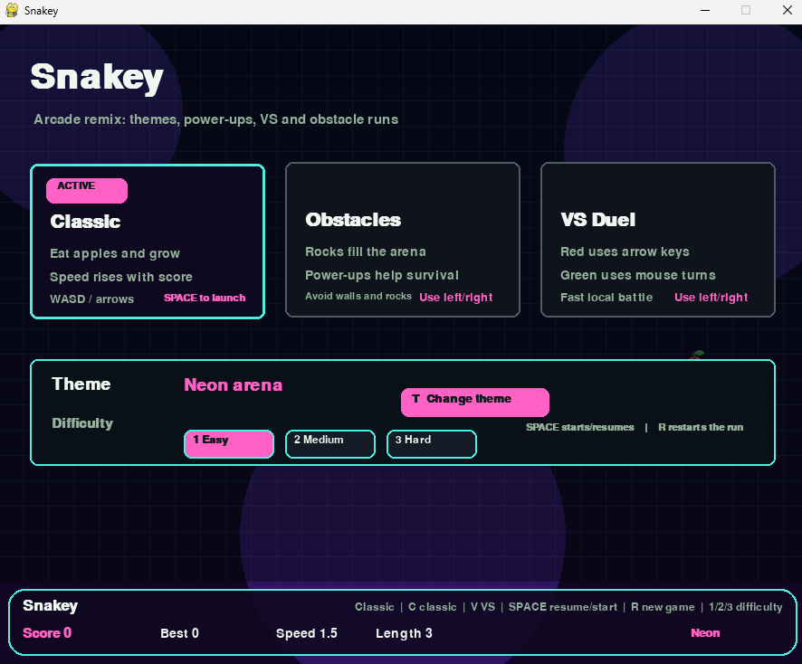
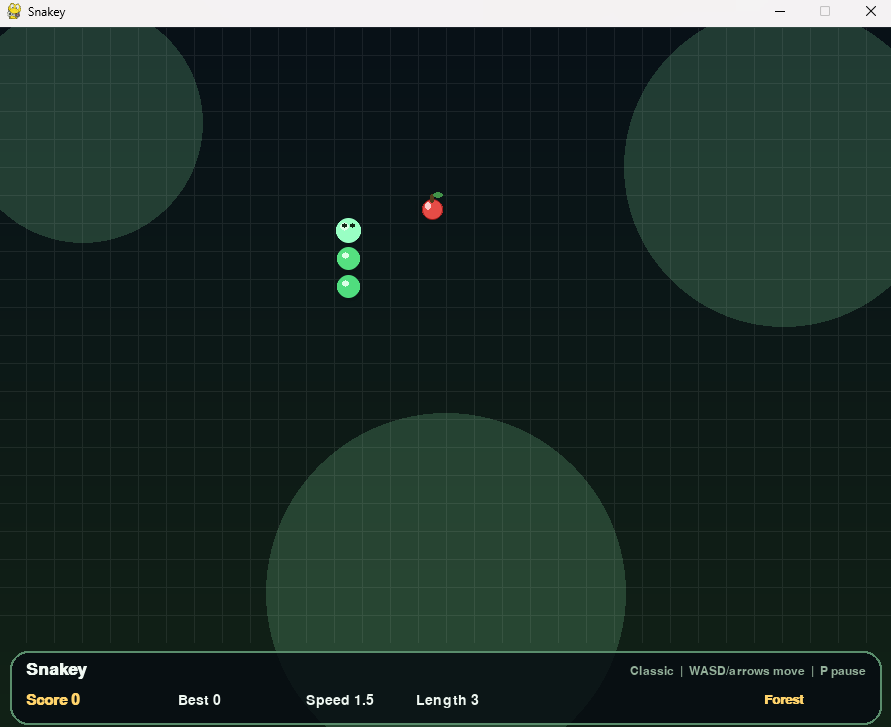
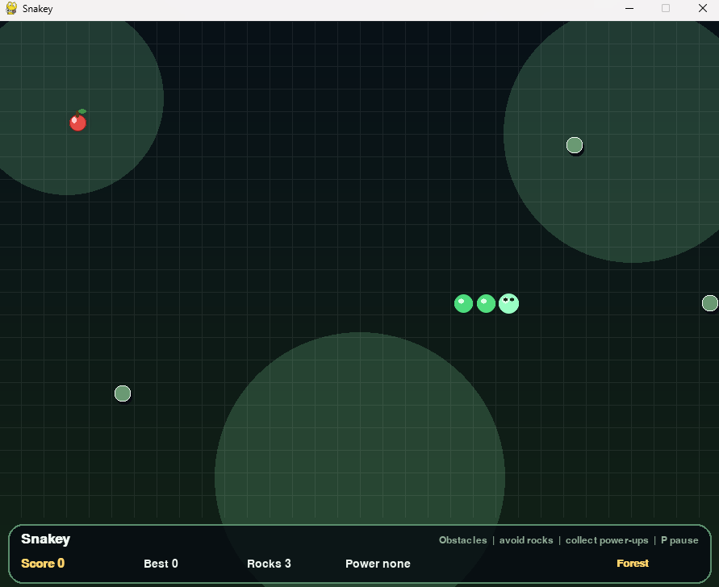
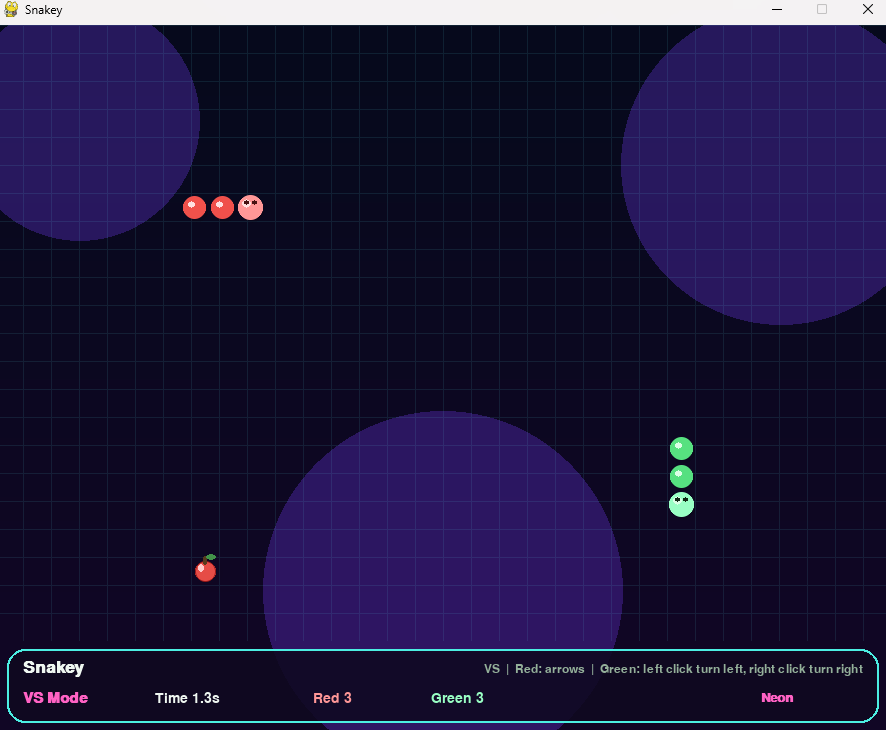

# Snakey

A polished arcade Snake game built with Python and pygame — featuring three distinct game modes, three difficulty levels, animated arena themes, power-ups, particles, screen shake, and local multiplayer.

<p>
  <a href="dist/Snakey.zip">
    
  </a>
</p>

> **Windows only** — download the zip, unzip it, and double-click `Snakey.exe`. No Python installation needed.

---

## Screenshots

| Menu | Classic Mode |
|------|-------------|
|  |  |

| Obstacles Mode | VS Duel |
|----------------|---------|
|  |  |

---

## Game Modes

### Classic
The original Snake experience — eat apples, grow longer, don't crash into yourself or the walls. The snake speeds up as your score climbs. Supports all three difficulty levels. Power-ups spawn periodically to shake things up.

### Obstacles Mode
Classic Snake but the arena fights back. Rocks appear on the grid from the start and **more spawn every time you eat**. The higher your score, the more crowded the board gets — up to 18 rocks at once. Power-ups are available and essential for survival. The end-screen reports your final score and how many rocks were on the grid when you crashed.

### VS Duel
Local two-player head-to-head. **Red snake** (arrow keys) vs **Green snake** (mouse clicks). Both snakes chase the same food — whoever forces the other into a wall or their own body wins. The game tracks survival time and snake length. No power-ups; pure speed and reaction.

---

## Difficulty Levels

Difficulty only applies to **Classic** and **Obstacles** modes (VS always runs at a fixed speed).

| Difficulty | Starting Speed | Max Speed | Notes |
|------------|---------------|-----------|-------|
| **Easy**   | 1.5 steps/sec | 3.5       | Relaxed pace — great for learning the controls |
| **Medium** | 6 steps/sec   | 14        | Default challenge — speed grows noticeably with score |
| **Hard**   | 8 steps/sec   | 17        | Full-speed from the start — tiny margin for error |

Speed increases by 1 step/sec for every 4 points scored and is capped at the difficulty maximum. In **Obstacles** mode an extra +0.5 is added on top.

---

## Power-Ups

Power-ups spawn in **Classic** and **Obstacles** modes every 3 points. They cycle in order and disappear after 8 seconds if not collected.

| Icon | Type | Effect | Duration |
|------|------|--------|----------|
| **S** (yellow) | Speed Boost | +2 steps/sec | 6 s |
| **T** (blue) | Slow Time | −2 steps/sec (min 1) | 6.5 s |
| **H** (green) | Shield | Absorbs the next fatal collision | 12 s |
| **2** (pink) | Double Score | Each apple counts as 2 points | 8 s |

---

## Arena Themes

The game starts in **Neon** arena by default. In the menu, click the **T Change theme** button or press `T` to cycle through themes. Each theme changes the background gradient, grid colour, glow orbs, and HUD accent colour.

| Theme | Vibe |
|-------|------|
| **Forest** | Dark green gradient, soft amber accents |
| **Neon** | Deep violet, cyan grid, hot-pink power-up glow |
| **Lava** | Dark red-orange, fiery border highlights |
| **Ice** | Deep blue, cool sky-blue grid and accents |

---

## Controls

### Menu
| Key | Action |
|-----|--------|
| `Left` / `Right` arrows | Cycle through mode cards |
| `C` | Select Classic mode |
| `O` | Select Obstacles mode |
| `V` | Select VS Duel mode |
| `1` / `2` / `3` | Set difficulty (Easy / Medium / Hard) |
| `T` | Cycle arena theme |
| `Space` or `Enter` | Start / resume game |
| `R` | Start a fresh game immediately |

You can also click the mode cards, difficulty buttons, **T Change theme**, **SPACE Start**, and **R** directly in the menu.

### In-Game — Classic & Obstacles
| Key | Action |
|-----|--------|
| `W` / `↑` | Move up |
| `S` / `↓` | Move down |
| `A` / `←` | Move left |
| `D` / `→` | Move right |
| `P` | Pause |
| `Space` | Resume from pause |
| `R` | Restart (from game over or pause) |
| `Esc` | Return to menu |

### VS Duel — Red snake
| Key | Action |
|-----|--------|
| `↑ ↓ ← →` | Move |

### VS Duel — Green snake
| Input | Action |
|-------|--------|
| `Left click` | Turn left |
| `Right click` | Turn right |

---

## HUD

The bottom panel shows context-aware information for each mode:

- **Classic**: Score · Best score · Current speed · Snake length
- **Obstacles**: Score · Best score · Rock count · Active power-up
- **VS Duel**: Survival time · Red snake length · Green snake length

---

## Download & Play (Windows)

No Python required.

1. Click the **Download** badge at the top of this page (or grab `dist/Snakey.zip` directly)
2. Unzip the archive
3. Double-click **Snakey.exe**

---

## Run from Source

**Requirements**

- Python 3.10+
- `pygame`

**Install dependencies**

```bash
pip install pygame
```

**Launch**

```bash
python main.py
```

**Run tests**

```bash
python -m unittest discover tests
```

---

## Project Structure

```
snake-game/
├── src/
│   ├── snake_game.py      # main loop, input handling, state transitions
│   ├── snake_core.py      # drawing, board constants, HUD, visual helpers
│   ├── snake_session.py   # difficulty presets, game state, run helpers
│   └── snake_audio.py     # sound effects and music synthesis
├── tests/
│   ├── test_regression.py # unit & regression tests
│   └── test_smoke.py      # pygame rendering smoke tests
├── screenshots/           # screenshots used in this README
├── dist/                  # pre-built Windows executable and zip
├── main.py                # entry point
└── README.md
```
